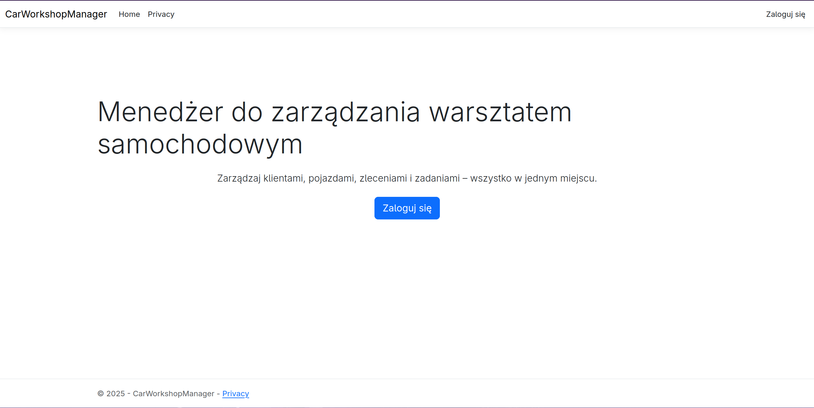

# Car Workshop Management System

Application for managing a car workshop, including customer management, order management, and user management. Allows for tracking of customer cars and orders together with car parts.

## Logging in

1. Open the application.

2. Click on the "Login" button.

3. Enter your username and password.

4. Click on the "Login" button to access the system.

Login credentials are stored in cookies, so if you close the page and reopen it, you will be still logged in.

## Roles

- **Admin**: Has full access to all features, including user management and system settings.

- **Receptionist**: Can manage customer data, create and manage orders.

- **Mechanic**: Can view and update orders assigned to them.

## CI/CD

The project uses GitHub Actions. The workflow is defined in `.github/workflows/dotnet-pr.yml`. It includes steps for building the project and running tests. This workflow is triggered on pull requests to the `main` branch.

I host Github Runner on my server.
